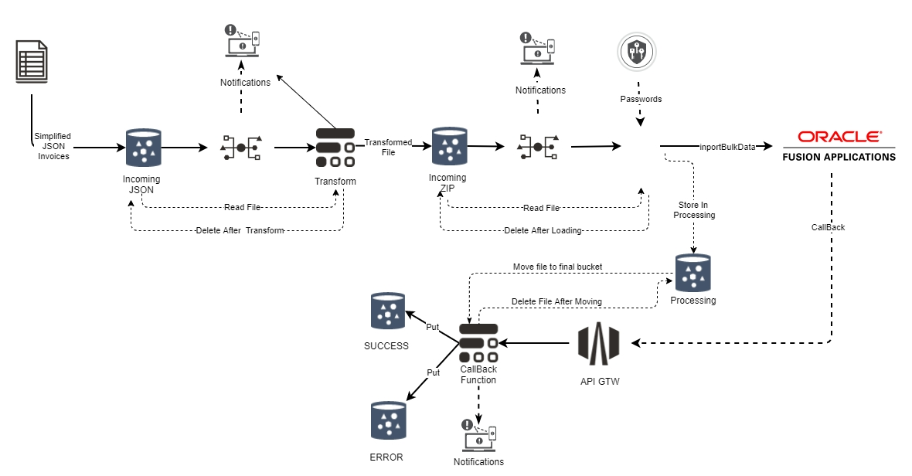
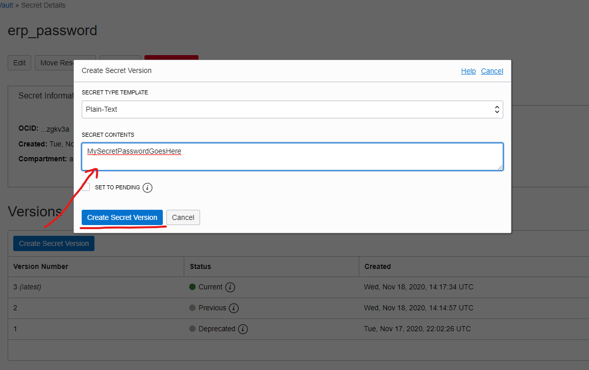

# Serverless SaaS ERP Data Loading 

## Introduction

This solution shows how you can use components in Oracle Cloud Infrastructure (OCI) to build a serverless data loading solution for Oracle Fusion ERP. This solution specifically targets components such as OCI Cloud Functions, Object Storage buckets, OCI Events and Event rules and OCI Notifications to provide a serverless solution where data can be loaded into Oracle Fusion ERP by simply placing a simplified JSON file into a Storage bucket.

This solution has a number of advantages over traditional solutions

- When not being used, no services are running and therefore are at zero cost to the customer
- No server upgrades required
- No server patches required
- All password secrets are stored safely within secure OCI Vaults
- Scaling up/down is automatically done by the serverless framework

The core components of this solution comprises of three serverless Oracle Cloud Functions :

1. Transformation function : This cloud function transforms an incoming JSON Payload into the ERP (invoices) specific format and wraps the files into a single ZIP file. The ZIP file is then stored on OCI Object Storage for future processing
2. Data Loading function : This function loads the data from OCI Object Storage and loads it into Oracle Fusion ERP
3. A call-back processing function : This function waits for a call-back from Oracle Fusion and then parses it to see if it succeeded or failed. 

For more information please refer to the blog article on [A-Team Chronicles]( https://www.ateam-oracle.com/loading-data-into-oracle-fusion-saas-serverless-style-v2)

### Services / libraries used in this sample

- [Oracle Fusion ERP](https://www.oracle.com/uk/erp/) (Release 20B+)
- Oracle Cloud Infrastructure
  - [Oracle Cloud Functions](https://www.oracle.com/uk/cloud-native/functions/)
  - [Oracle Cloud Events](https://www.oracle.com/uk/cloud-native/events-service/)
  - [Oracle Cloud Notifications](https://www.oracle.com/uk/devops/notifications/)
  - [Oracle Cloud Vault](https://www.oracle.com/uk/security/cloud-security/key-management/)
- [HashiCorp Terraform (0.13+)](https://www.Terraform.io/)
- [Oracle Terraform Provider](https://registry.Terraform.io/providers/hashicorp/oci/latest/docs)
- Python 3.8+
  - [Python OCI SDK (2.23+)](https://oracle-cloud-infrastructure-python-sdk.readthedocs.io/en/latest/)
  - [Python Requests library (2.24+)](https://requests.readthedocs.io/en/master/)
  - [Oracle Cloud Functions Developer Kit (Python)](https://github.com/fnproject/fdk-python)

### Features / patterns demonstrated in this sample

- Serverless solution
- Demonstrates how to deploy the entire solution to OCI using Terraform
  - Specific call out showing how to deploy Oracle Cloud functions to OCI using Terraform scripts
- Storing Oracle passwords securely within the OCI vault and retrieving them using Python code
- Reading/writing data to OCI Storage buckets
- Sending notifications to users 
- Capturing OCI Events and launching Oracle Cloud Functions based on predetermined events
- Loading data into Oracle Fusion applications via the integration REST API
- Transforming a JSON structure into a Oracle ERP cloud compatible data file

## Solution architecture

When a file is inserted into the processing bucket a OCI event is emitted by OCI. This event is configured to call a serverless cloud function which transforms the file from a simplified JSON format to the specific format required by Oracle Fusion ERP. An event can be used to launch multiple actions, calling Oracle Cloud Functions is one action, sending notifications is another.  Once the cloud function has finished processing the file it inserts the file into a new storage bucket and then the next phase of loading the data proceeds.

A short video describing this architecture can be found on YouTube at this link [ERP data load using Serverless Technologies](https://www.youtube.com/watch?v=Ffq15paItsQ)

## Installation

### Pre-requisites

1. Ensure Oracle Cloud Functions is installed and that you can deploy a simple Python based cloud function. If you haven't already installed and configured Oracle Cloud Functions then we can recommend going through the [Oracle cloud functions quickstart ](https://www.oracle.com/webfolder/technetwork/tutorials/infographics/oci_faas_gettingstarted_quickview/functions_quickview_top/functions_quickview/index.html) as this will not only help you setup and configure your environment but also show you how to deploy some sample Oracle Cloud Functions.
2. Ensure Terraform is installed and you are able to deploy OCI components to OCI (eg. create a storage bucket)
3. Ensure Fusion Applications is functionally set up to accept the data you are looking to load

### Creating the cloud artefacts in OCI cloud

1. Navigate to the `terraform` directory
   
2. Edit/create new `terraform/config.auto.tfvars ` file entering parameters based on your system preferences. This file contains system wide specific variables needed for the solution to work and you can use the `config.auto.tfvars.template` as a template for this file
   
3. Edit/create new `terraform/oci.auto.tfvars`. This file contains OCI system specific variables needed for the solution to communicate with OCI. This file can be copied from your $HOME/.oci/config file, without the section header. You can use the `oci_config.auto.tfvars.template` as a template for this file
   
4. Edit/create a new `terraform/terraform.tfvars` file using  `Terraform.tfvars.template` as a template file
   
5. Within `variables.tf` make sure you modify the `erp_paramlist` so that it matches your systems functional setup (e.g. Business Unit Id). If you want to load different objects, i.e.  other than invoices, then you will also need to modify `erp_jobname` to match your Oracle Fusion configuration. 

   A future version of this sample will allow the user to provide this information as a runtime parameter for each and every import job, pull requests welcome!

7. Run Terraform to create all your resources in OCI

   `terraform init`

   `terraform plan`
   
   `terraform apply`

8. This step creates all the resources in OCI , including the setup of a VCN, an API Gateway, uploading the Oracle Cloud Functions and creating a OCI Vault to store the Fusion ERP password. The Terraform script does not create the OCI Vault Secret as this is currently not possible using Terraform. The Terraform script will however create a dummy ERP password within the vault and you will need to update this with the real password for your Oracle Fusion ERP system.

9. Update the *erppassword* secret within the Oracle vault 

   - Log In to OCI console

   - Navigate to the vault (**Menu Security/Vault/VaultName**)

   - Within resources select **Secrets**

   - Select the **erp_password** Secret

   - Create a new secret version and enter your ERP password here

     

   - Once the secret has been created, make a note of the secret OCID

10. Once the Terraform script has run you should receive an email asking to confirm the notification subscriptions.

## Running the sample

The current sample imports invoices into Oracle Fusion.

1. Examine the sample JSON file, this is a simplified JSON representation of the invoice and invoice lines. Within this file ensure
   1. The  "`invoice_id`" and "invoice number" are unique
   2. The  `supplierNumber` exists in your Fusion system
   3. Make any other modifications, like adding line items etc
2. Upload the JSON file into the **JSON Incoming Bucket** on OCI cloud Storage.
3. Within a minute you should see that the file has disappeared and will reappear in the **ZIP Incoming Bucket,** this means the transform process has completed and a ERP SaaS ZIP file has been created.
4. Within a minute you should see the file has disappeared and is now in the "Processing" storage bucket/ The filename will also have a JOBID appended to it. This means the *Load* function has executed and has loaded the file into Oracle Fusion ERP
5. Within a couple of minutes, it depends how busy Fusion ERP is, you should then see the ZIP file be moved from the "Processing" bucket to either the "Success" or "Failure" bucket. this has occurred because Oracle Fusion SaaS has imported the data and the function examined the payload and determined if the data was "processed" correctly. This does not mean the data was *loaded*, there could have been bad data, duplicate rows or invalid business unit. A future enhancement would be to examine the status of the file load by processing the ESS job log file.
6. Go into Oracle Fusion, Procurement, Invoices and query your newly serverless loaded invoice.

## Troubleshooting

- If things dont work, here are some [Troubleshooting tips for cloud functions](https://docs.cloud.oracle.com/en-us/iaas/Content/Functions/Tasks/functionstroubleshooting.htm) you can try.

- The Oracle Cloud Functions are configured to emit logging info using standard system logging, this can be useful when debugging the functions. This logging can be either retrieved in OCI Logging or you can use a 3rd party remote syslogurl logging service. OCI Logging is installed/configured by default , if you want to use a 3rd party system like [papertrail](https://papertrailapp.com/) then setup the remote logging using the following command.

  `fn update app Serverless_Integration --syslog-url <syslogurl>`

- For more information see this blog article by the development organisation [https://blogs.oracle.com/developers/simple-serverless-logging-for-oracle-function](https://blogs.oracle.com/developers/simple-serverless-logging-for-oracle-functions)

## Enhancing the sample

Adding support for new ERP Objects

- The current transform cloud function focuses on the invoice, and Invoice lines, object. The `erp-transform-file` uses a template CSV file where elements to be replaced are marked with $<NAME> and are replaced by the Python script. 
- To add a new object you would need to :
  - a) Create your custom JSON file format for the data you are uploading into Oracle Fusion ERP
  - b) Create your own custom transform cloud function. This cloud function would be similar to the `erp-transform-file.py ` file. You can use the existing `erp-transform-file` Python code as a template demonstrating how to parse the file, extract out the JSON elements, construct the ERP Specific CSV file, ZIP the resulting files and finally interact with OCI services such as storage buckets and notifications.
  - c) For each new ERP object you will also need also provide the **job name(s)** and **param list** (parameters in Terraform `fusion_metadata` object within the `general_config.auto.tfvars`. This information can be obtained by executing a data load manually in Oracle Fusion ERP and then seeing the resulting process details in the schedule processes section (aka ESS)

Supporting multiple objects using multiple instances of the code

- This sample currently deals with a single data file and destination object (i.e. invoices and invoice lines). To support multiple objects you will need to deploy the sample multiple times with different bucket names, configuration files  etc. 

Supporting multiple objects with a single code base

- An interesting enhancement would be to allow the users the ability to create multiple "*profiles*" for different incoming data files, the discriminator could be based on the file prefix (e.g. invoices_batch10.json). When a file is uploaded into the JSON OCI Bucket, a router function could look up the appropriate transform function by using the prefix name as a key. Therefore instead of a function called `erp-transform-file` we would have multiple Oracle Cloud Functions for each object type, i.e. one called *erp-transform-invoices, erp-transform-gl* etc. These Oracle Cloud Functions could still place their resulting ZIP files into a single OCI ZIP bucket and then again a single `erp-file-load` function could determine the right *job names, param lists* based on the file prefix. 

Supporting large files

- The transform cloud function reads the entire JSON file into memory and generates the CSV file in Oracle Cloud Functions temporary storage. Whilst this approach is efficient it does mean there is a limit to the amount of data the cloud function can process. Currently the max amount of memory an Oracle Cloud Function can be allocated is 1Gb and disk maximums of 256Mb in */tmp* also apply. This means the max size of the zip file that can be created is approx. 256Mb before being transferred to OCI Object Storage Cloud. If you need to produce zip files larger than 256Mb then either split the load into smaller chunks or implement a streaming approach in the various Oracle Cloud Functions in this sample.

  - See https://docs.cloud.oracle.com/en-us/iaas/Content/Functions/Tasks/functionsaccessinglocalfilesystem.htm for more details on Oracle functions service limits

## Security

Oracle takes security seriously and has a dedicated response team for [reporting security vulnerabilities](./SECURITY.md) and to answer any security and vulnerability related questions.

## Contributing

We welcome all contributions to this sample and have a  [contribution guide](./CONTRIBUTING.md)  for you to follow if you'd like to contribute.

## Help

If you need help with this sample, please log an issue within this repository and the code owners will help out where we can.

Copyright (c) 2021, Oracle and/or its affiliates. Licensed under the Universal Permissive License v 1.0 as shown at https://oss.oracle.com/licenses/upl.